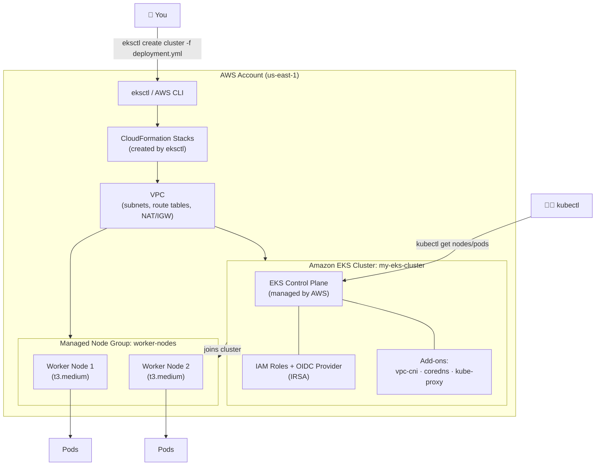

# devOps-Kubernetes-project

Declarative config (`deployment.yml`) to provision an Amazon EKS cluster with
**2 worker nodes** using [`eksctl`](https://eksctl.io/).

> **Nothing in this repo creates AWS resources by itself.** The commands
> below are the steps *you* run, on demand, when you're ready to actually
> provision the cluster. Until then, `deployment.yml` just sits here as code.

## Architecture



**Flow:** you run `eksctl create cluster -f deployment.yml` → eksctl provisions
CloudFormation stacks → those create the VPC, the EKS control plane (AWS-managed),
IAM/OIDC setup, and a managed node group of **2 EC2 worker nodes** → the nodes
register with the control plane and are ready to run pods → you interact with
the cluster afterward via `kubectl`.

## Prerequisites

Install these tools locally:

| Tool | Purpose | Install |
|------|---------|---------|
| AWS CLI v2 | AWS authentication | https://docs.aws.amazon.com/cli/latest/userguide/getting-started-install.html |
| `eksctl` | Creates/manages the EKS cluster | https://eksctl.io/installation/ |
| `kubectl` | Talk to the cluster once it exists | https://kubernetes.io/docs/tasks/tools/ |

macOS (Homebrew) quick install:

```bash
brew install awscli eksctl kubectl
```

Verify versions:

```bash
aws --version
eksctl version
kubectl version --client
```

## Step-by-step: create the cluster

1. **Configure AWS credentials** (an IAM user/role with EKS, EC2, VPC,
   IAM and CloudFormation permissions):

   ```bash
   aws configure
   ```

   Confirm the identity/account you'll be deploying into:

   ```bash
   aws sts get-caller-identity
   ```

2. **Review / edit `deployment.yml`** — set your cluster `name`, `region`,
   Kubernetes `version`, and instance type as needed.

3. **(Optional) Dry-run / validate the config** without creating anything:

   ```bash
   eksctl create cluster -f deployment.yml --dry-run
   ```

4. **Create the cluster** (this is the step that actually provisions AWS
   resources — VPC, EKS control plane, 2 managed worker nodes, etc. Takes
   ~15-20 minutes):

   ```bash
   eksctl create cluster -f deployment.yml
   ```

   `eksctl` automatically updates your local `~/.kube/config` so `kubectl`
   points at the new cluster.

5. **Verify the cluster and nodes:**

   ```bash
   kubectl get nodes
   kubectl get pods -A
   ```

   You should see 2 worker nodes in `Ready` state.

6. **Check the cluster via eksctl:**

   ```bash
   eksctl get cluster --region us-east-1
   eksctl get nodegroup --cluster my-eks-cluster --region us-east-1
   ```

## Tearing it down

To avoid ongoing AWS charges, delete everything when you're done:

```bash
eksctl delete cluster -f deployment.yml
```

## Files

- `deployment.yml` — eksctl `ClusterConfig` defining the EKS cluster and its
  2-node managed node group.
